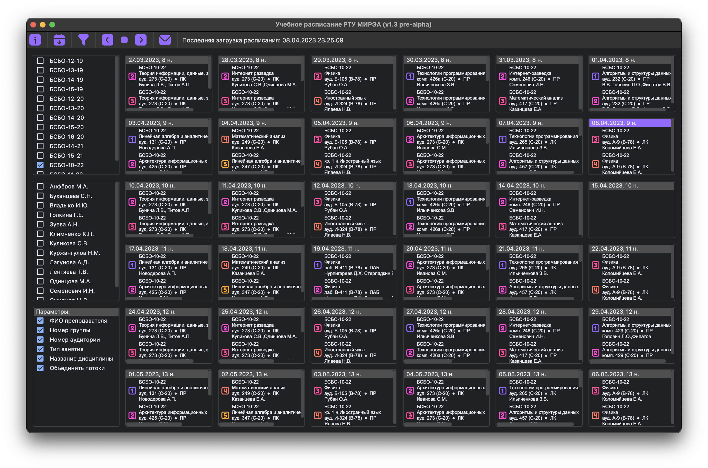

# Учебное расписание РТУ МИРЭА

Учебное расписание РТУ МИРЭА — это десктопное приложение для отслеживания расписания студентов и преподавателей. 
Особенностью данного решения являются возможность параллельно отобразить расписание как группы студента, так и преподавателя, в том числе одновременно и/или несколько, а также представление в виде календаря.

---

###### Разработал [@evsmol](https://github.com/evsmol), лаборант кафедры КБ-9 «Предметно-ориентированные информационные системы» (ул. Стромынка, д. 20. каб. 145г)

---

