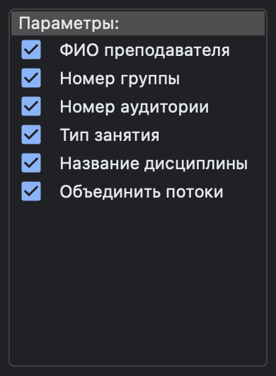

# Учебное расписание РТУ МИРЭА

Учебное расписание РТУ МИРЭА — это десктопное приложение для отслеживания расписания студентов и преподавателей. 
Особенностью данного решения являются возможность параллельно отобразить расписание как группы студента, так и преподавателя (одновременно и/или несколько), а также представление в виде календаря.

---

###### Разработал [@evsmol](https://github.com/evsmol), лаборант кафедры КБ-9 «Предметно-ориентированные информационные системы» (ул. Стромынка, д. 20. каб. 145г)

---

## Основные элементы интерфейса

|         Элемент          | Описание                                                                                                                                    |
|:------------------------:|:--------------------------------------------------------------------------------------------------------------------------------------------|
|       | Переход на страницу с релизами для получения информации о приложении и его скачивания                                                       |
|   | Переход к окну загрузки расписания. Далее для корректного слияния учебного расписания и календаря потребуется указать дату начала семестра  |
|     | Переход к окну выбора избранных групп и преподавателей. Выбранные группы и преподаватели будут отображаться в блоках слева в главном окне   |
|       | Переход к предыдущему месяцу                                                                                                                |
|        | Переход к текущему месяцу                                                                                                                   |
|      | Переход к следующему месяцу                                                                                                                 |
|     | Сообщить об ошибке в работе приложения или предложить оптимизацию или новый функционал                                                      |
|    | Дата и время последней ручной загрузки расписания (расписание загружается с [официального сайта РТУ МИРЭА](https://www.mirea.ru/schedule/)) |
|      | Блоки выбора отображаемого расписания групп и преподавателей                                                                                |
|  | Блок выбора параметров отображения                                                                                                          |
